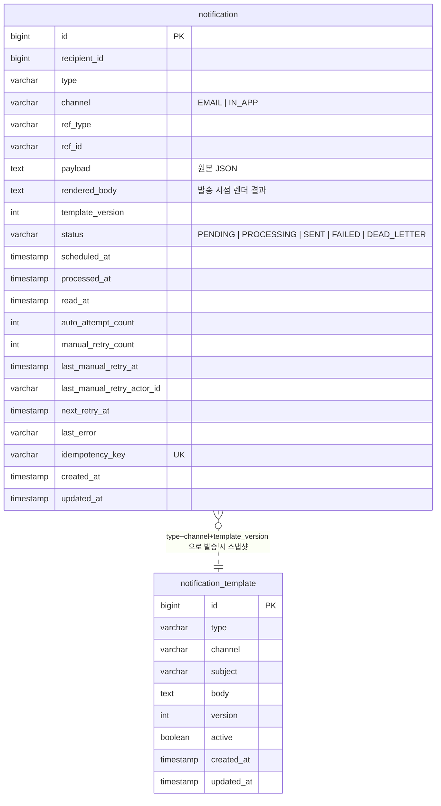

# 알림 발송 시스템

## 주요 문서

- [비동기 처리 구조 + 재시도 정책](docs/async-and-retry.md)
- [요구사항 해석 + 개선 의견](docs/interpretation.md)
- [Claude Workflow 활용 방법](.claude/docs/claude-workflow.md)

<details>
<summary><b>📡 API 명세 — 펼쳐서 보기</b></summary>

### 사용자 API

| Method | Path | 설명 |
|---|---|---|
| `POST` | `/api/v1/notifications` | 알림 등록 (멱등) |
| `GET` | `/api/v1/notifications/{id}` | 단건 조회 — `X-User-Id` 헤더 필수 |
| `PATCH` | `/api/v1/notifications/{id}/read` | 읽음 처리 — `X-User-Id` 헤더 필수 |
| `GET` | `/api/v1/users/{userId}/notifications?read=` | 수신함 목록 (read 필터 옵션) |

### 운영 API

| Method | Path | 설명 |
|---|---|---|
| `GET` | `/api/v1/admin/notifications/dead-letters` | DEAD_LETTER 목록 |
| `POST` | `/api/v1/admin/notifications/{id}/retry` | DLQ 수동 재시도 — `X-Actor-Id` 헤더 필수 |
| `POST` | `/api/v1/admin/templates` | 템플릿 등록 (버전 자동 증가) |
| `GET` | `/api/v1/admin/templates` | 템플릿 목록 |

### 샘플: 알림 등록

```http
POST /api/v1/notifications
Content-Type: application/json

{
  "recipientId": 42,
  "type": "COURSE_ENROLLMENT_COMPLETED",
  "channel": "EMAIL",
  "refType": "COURSE",
  "refId": "c-100",
  "payload": "{\"courseName\":\"Kotlin in Action\"}",
  "scheduledAt": null
}
```

응답 (`201 Created`, `Location: /api/v1/notifications/1`):

```json
{
  "id": 1,
  "recipientId": 42,
  "type": "COURSE_ENROLLMENT_COMPLETED",
  "channel": "EMAIL",
  "refType": "COURSE",
  "refId": "c-100",
  "scheduledAt": "2026-04-28T01:00:00Z",
  "status": "PENDING",
  "autoAttemptCount": 0,
  "nextRetryAt": null,
  "readAt": null,
  "processedAt": null,
  "lastError": null,
  "renderedBody": null,
  "templateVersion": null,
  "manualRetryCount": 0,
  "lastManualRetryAt": null,
  "createdAt": "2026-04-28T01:00:00Z"
}
```

같은 페이로드로 한 번 더 호출해도 동일한 `id` 가 반환됩니다 (멱등 — DB UNIQUE 제약 + duplicate-key 무시).

### 샘플: DLQ 수동 재시도

```http
POST /api/v1/admin/notifications/1/retry
X-Actor-Id: admin-001
```

응답은 `200 OK` 이고, `status` 가 `DEAD_LETTER → PENDING` 으로 전이되며 `manualRetryCount`, `lastManualRetryAt`, `lastManualRetryActorId` 가 갱신됩니다. 한도(3회) 초과 시 `409 Conflict` 를 돌려줍니다.

### 에러 응답 형식

전 엔드포인트가 동일한 형식을 사용합니다.

```json
{
  "code": "VALIDATION_FAILED",
  "message": "request body validation failed",
  "details": {
    "recipientId": "must not be null"
  }
}
```

| HTTP | code | 발생 조건 |
|---|---|---|
| `400` | `VALIDATION_FAILED` | 본문/헤더/파라미터 검증 실패 |
| `404` | `NOTIFICATION_NOT_FOUND` | 존재하지 않거나 타인 알림 (정보 노출 차단) |
| `409` | `IDEMPOTENCY_CONFLICT` | 동일 키에 다른 payload 가 옴 |
| `409` | `MANUAL_RETRY_LIMIT_EXCEEDED` | 수동 재시도 한도 초과 |
| `409` | `NOT_DEAD_LETTER` | DLQ 상태가 아닌 row 에 retry 호출 |

</details>

<details>
<summary><b>🗄️ DB 스키마 / ERD — 펼쳐서 보기</b></summary>

### ERD



`notification` 과 `notification_template` 은 FK 로 묶이지 않습니다. 발송 시점에 렌더 결과(`rendered_body`)와 스냅샷 버전(`template_version`)을 `notification` 자체에 저장하기 때문에, 템플릿이 나중에 수정되어도 발송된 메시지는 그대로 보존됩니다.

### 인덱스

| 인덱스 | 컬럼 | 용도 |
|---|---|---|
| `uk_notification_idempotency_key` | `idempotency_key` UNIQUE | 멱등성 — DB 가 중복 INSERT 거절 |
| `ix_notification_status_scheduled` | `(status, scheduled_at)` | 워커의 `PENDING` 폴링 |
| `ix_notification_status_retry` | `(status, next_retry_at)` | 자동 재시도 대상 폴링 |
| `ix_notification_recipient_read` | `(recipient_id, read_at)` | 사용자 수신함 (읽음 필터) |
| `notification_template` UNIQUE | `(type, channel, version)` | 같은 타입/채널 에서 버전 중복 차단 |

### 상태 머신

```
                        ┌─────────────────────────────────┐
                        ↓                                 │
PENDING ──claim──▶ PROCESSING ──send 성공──▶ SENT          │
                        │                                 │
                        ├──send 실패 (autoAttemptCount<5)──▶ FAILED
                        │                                 │
                        │                          (next_retry_at 도달 시 재폴링)
                        │                                 │
                        ├──send 실패 (autoAttemptCount=5)──▶ DEAD_LETTER
                        │                                          │
                        │                                          │ admin retry
                        │                                          ↓
                        │                                       PENDING (autoAttemptCount=0)
                        │
                        └──updated_at > 5분 (타임아웃)──▶ PENDING (Recovery Job)
```

</details>

---

## 실행

```bash
docker compose up -d
```

| 서비스 | 포트 | |
|---|---|---|
| `app` | `28080` | http://localhost:28080/swagger-ui/index.html |
| `mysql` | `23306` | `notification` DB |

### E2E

- 슬라이스 / 통합 테스트는 H2 위에서 동작하므로, `SELECT FOR UPDATE SKIP LOCKED` 같은 MySQL 8 전용 락 동작과 비동기 워커 전이가 운영 환경과 동치인지를 코드로 보장하지 못합니다.
- [`NotificationE2eTest`](src/test/kotlin/notification/practice/e2e/NotificationE2eTest.kt) 는 Testcontainers 로 MySQL 8 을 띄우고, 임의 포트로 부팅한 앱에 RestAssured 로 HTTP 호출하여 멱등성·권한·읽음 멱등·DLQ retry 가드·검증 실패 등 9 시나리오를 운영 DB 위에서 가드합니다. 비동기 전이는 Awaitility 로 폴링합니다.
- 실행: `./gradlew test --tests "notification.practice.e2e.*"`. CI 빠른 단계에서 빼고 싶을 때는 `./gradlew test -PexcludeE2E` 로 `@Tag("e2e")` 를 제외합니다.
- 손으로 점검하고 싶을 때 따라갈 수 있는 curl 흐름과 응답 본문 기록은 [`docs/e2e-checklist.md`](docs/e2e-checklist.md) 에 정리해 두었습니다.

---

## 설계 결정과 사고 과정

요구사항 자체가 아니라 *"왜 이걸 골랐는가"* 를 적었습니다. 비교한 대안과 탈락 사유를 함께 남겨, 같은 자리에서 다시 골라도 같은 결론에 도달하도록 만들었습니다.

### 결정 한눈에 보기

| # | 의사결정 | 채택 | 결정적 근거 |
|---|---|---|---|
| 1 | 비동기 처리 구조 | Outbox + 폴링 워커 | 메모리 큐 / `@Async` 는 재시작 시 유실, DB 가 영속성·분산 락을 동시에 제공 |
| 2 | 멱등성 키 생성 주체 | 서버 + `sha256(...+scheduledAt)` | 호출자 누락이 곧 중복 발송 |
| 3 | 분산 안전 — 락 방식 | `FOR UPDATE SKIP LOCKED` | row 단위 락으로 워커 수만큼 처리량 선형 증가 |
| 4 | DEAD_LETTER 카운터 | 자동 / 수동 독립 | 무한 재시도 방지 + 운영 추적 |
| 5 | 템플릿 렌더링 시점 | 발송 직전 + `rendered_body` 영속화 | 최신 템플릿 + 발송 시점 메시지 보존 |
| 6 | 다중 디바이스 읽음 처리 | 조건부 UPDATE (`read_at IS NULL`) | 멱등 + 첫 읽음 시각 보존 + 락 불필요 |
| 7 | 운영 전환 가능 구조 | `NotificationDispatcher` 인터페이스 분리 | 빈 교체로 Kafka 전환 |
| 8 | 처리 타임아웃 임계값 | 5 분 | 외부 게이트웨이 타임아웃 + 사용자 체감의 절충 |
| 9 | 발송 스케줄링 인프라 | `scheduled_at` 컬럼 통합 | 별도 스케줄러 불필요 — 즉시·예약 발송이 같은 코드 경로 |
| 10 | 타인 알림 접근 응답 | `404 NOTIFICATION_NOT_FOUND` | ID 존재 자체를 노출하지 않음 |

각 결정의 사고 과정은 아래에 정리해 두었습니다.

---

### 1. 비동기 처리 — 왜 outbox 폴링인가

요구사항 두 줄이 후보를 좁혔습니다.

- *"서버 재시작 후에도 미처리 알림이 유실 없이 재처리되어야 한다"*
- *"다중 인스턴스 환경에서 동일 알림이 중복 처리되지 않아야 한다"*

`@Async`, `ApplicationEvent`, 인메모리 큐는 모두 첫 번째 요구사항에 걸립니다 — 큐가 메모리에만 있으면 JVM 종료와 함께 사라집니다. 두 번째는 분산 락이 추가로 필요해집니다.

DB 가 이미 영속성과 분산 락(`SELECT ... FOR UPDATE`)을 동시에 제공하므로 outbox 패턴이 **가장 적은 추가 인프라로 두 요구사항을 모두 만족** 합니다. 거기에 dispatcher 추상을 두면 미래에 Kafka 등으로 갈아탈 때 빈 교체 한 곳만 바꾸면 됩니다 — 점진적 마이그레이션 경로 자체가 outbox 로 깔립니다.

전체 비교는 [docs/async-and-retry.md §3](docs/async-and-retry.md) 를 참고해 주세요.

---

### 2. 멱등성 키 — 클라이언트 vs 서버 생성

호출자가 키를 직접 보내는 모델도 가능했습니다. 두 옵션의 위험은 다릅니다.

| 옵션 | 장점 | 단점 |
|---|---|---|
| 클라이언트 제공 | 호출자 의도를 그대로 키에 반영 | 호출자가 키를 잊으면 즉시 중복 발송 |
| **서버 생성 (채택)** | 한 곳에서 일관된 키 정책 | 호출자가 "굳이 다른 발송" 을 원할 때 표현 어려움 |

서버에서 결정적으로 생성하면 호출자는 *"같은 이벤트 = 같은 인자"* 만 보장하면 됩니다. 키 누락이라는 실패 모드 자체가 사라집니다.

```
idempotencyKey = sha256(eventType + ':' + refType + ':' + refId + ':' + recipientId + ':' + channel + ':' + scheduledAt)
```

`scheduledAt` 도 키에 포함했습니다 — 같은 이벤트라도 다른 시각에 예약 발송하는 케이스 (D-1 알림 / D-3 알림) 가 별개 row 로 다뤄져야 하기 때문입니다.

> 검증: 같은 페이로드 3회 호출 → DB row 1건, 응답 `id` 동일 ([`IdempotencyKeyTest`](src/test/kotlin/notification/practice/notification/IdempotencyKeyTest.kt))

---

### 3. 분산 안전 — `FOR UPDATE SKIP LOCKED` vs ShedLock

ShedLock 같은 *스케줄러 단위* 락은 결국 동시성을 1로 떨어뜨립니다 — 워커를 N 개 띄워도 한 번에 한 인스턴스만 일하게 됩니다. 처리량이 워커 수에 의존하지 않아 수평 확장의 의미가 옅어집니다.

`FOR UPDATE SKIP LOCKED` 는 **row 단위** 락입니다. 워커마다 락이 걸리지 않은 다음 row 를 가져가므로 처리량이 워커 수만큼 선형으로 증가합니다. 락 보유 시간을 짧게 (`PROCESSING` 마킹만 하고 즉시 commit, 실제 외부 호출은 락 밖) 유지하면 락 경합도 거의 없습니다.

| 방식 | 처리량 | 비고 |
|---|---|---|
| **`FOR UPDATE SKIP LOCKED` (채택)** | row 단위, 워커 수만큼 선형 | MySQL 8.0.1+ 필요 |
| 스케줄러 단위 분산 락 | 동시성 1로 제한 | 처리량 손실 |
| 비관적 락 (`SKIP LOCKED` 미사용) | row 단위지만 다른 워커가 대기 | 락 대기로 처리량 저하 |
| 낙관적 락 (`@Version`) | 충돌 후 재시도 | 충돌 빈도가 높을수록 비효율 |

MySQL 8.0.1+ 제약은 `docker-compose.yml` 의 `mysql:8.0` 이미지로 충족했습니다.

> 검증: 워커 3 개 동시에 `poll()` 호출 → 각 알림 정확히 1회 발송 ([`worker/ConcurrentWorkerTest`](src/test/kotlin/notification/practice/notification/worker/ConcurrentWorkerTest.kt))

---

### 4. DEAD_LETTER 카운터 분리

수동 재시도 시 `autoAttemptCount` 를 어떻게 다룰지가 핵심 트레이드오프였습니다.

| 옵션 | 동작 | 평가 |
|---|---|---|
| 완전 초기화 | `autoAttemptCount = 0` | 동일 원인이 그대로면 **무한 자동 재시도 위험** |
| 누적 유지 | 카운터 그대로 | 수동 재시도가 의미를 갖지 못함 — **즉시 다시 DEAD_LETTER** |
| **분리 (채택)** | `autoAttemptCount` / `manualRetryCount` 독립 | 자동 / 수동 구분 + 누가 언제 재시도했는지 추적 |

분리 정책은 두 가드레일과 함께 묶입니다.

- `manualRetryCount >= 3` 한도 — 운영자의 무한 클릭으로 인한 동일 원인 폭주 방지
- `lastManualRetryActorId` 기록 — 누가 언제 재시도를 트리거했는지 감사

> 검증: 한도 초과 시 `409 + MANUAL_RETRY_LIMIT_EXCEEDED` ([`ManualRetryTest`](src/test/kotlin/notification/practice/notification/ManualRetryTest.kt))

---

### 5. 템플릿 렌더링 시점

세 시점이 가능했습니다. 트레이드오프는 *"최신 템플릿 사용"* 과 *"실패 발견 시점"* 사이에 있습니다.

| 시점 | 최신 템플릿 반영 | 변수 누락 발견 | 발송 시점 메시지 보존 |
|---|---|---|---|
| 등록 시점 렌더 | ❌ (스냅샷 고정) | ✅ 즉시 | ✅ |
| 발송 직전 렌더 (저장 X) | ✅ | 발송 단계까지 지연 | ❌ (재발송 시 다른 결과) |
| **발송 직전 렌더 + 결과 영속화 (채택)** | ✅ | 발송 단계까지 지연 | ✅ |

`rendered_body` 와 `template_version` 이 `notification` row 에 함께 저장되므로 — 추후 템플릿이 수정되어도 *"실제로 무엇을 보냈는지"* 를 추적할 수 있습니다.

`notification` 과 `notification_template` 을 FK 로 묶지 않은 이유도 같습니다. FK 로 묶고 템플릿을 수정하면 과거 발송 row 의 의미가 흔들립니다. 스냅샷 분리가 더 안전합니다.

---

### 6. 다중 디바이스 읽음 처리 — 조건부 UPDATE

같은 알림에 다른 디바이스가 동시에 `PATCH ../read` 를 보내면 `read_at` 이 마지막 요청 시각으로 덮어 씌워질 수 있습니다. SELECT 후 UPDATE 패턴은 락이 필요하고, 무조건 UPDATE 는 첫 읽음 시각이 손실됩니다. 조건부 UPDATE 한 줄이 셋을 동시에 해결합니다.

```sql
UPDATE notification
   SET read_at = NOW()
 WHERE id = ?
   AND recipient_id = ?
   AND read_at IS NULL;   -- ◀ 첫 읽음 시각만 기록
```

| 방식 | 결과 |
|---|---|
| 무조건 UPDATE | 마지막 요청 시각으로 덮어씀 (첫 읽음 시각 손실) |
| `SELECT FOR UPDATE` 후 UPDATE | 정확하지만 불필요한 락 |
| **조건부 UPDATE (채택)** | 멱등 + 첫 읽음 시각 보존 + 추가 락 없음 |

`affected rows = 1` 이면 최초 읽음, `0` 이면 이미 읽음 (둘 다 `200 OK`, no-op) 입니다. DB row write lock 이 자동 직렬화하므로 별도 락이 필요 없습니다.

> 검증: 다중 디바이스 동시 PATCH → `read_at` 최초 시각 유지 ([`ReadNotificationTest`](src/test/kotlin/notification/practice/notification/ReadNotificationTest.kt))

---

### 7. 운영 전환 가능성을 위한 추상화

요구사항이 *"실제 운영 환경 전환 가능한 구조"* 를 요구했습니다. 미래에 Kafka 등으로 갈아탈 수 있도록 swap 지점을 미리 노출했습니다.

```kotlin
interface NotificationDispatcher {            // 발송 트리거
    fun dispatch(notification: Notification)
}

class OutboxDispatcher : NotificationDispatcher  // 현재 (no-op, 워커가 폴링)
class KafkaDispatcher : NotificationDispatcher  // 미래 — 빈 교체만으로 swap

interface NotificationSender {                  // 채널별 발송
    fun send(notification: Notification)
}
class EmailSender : NotificationSender
class InAppSender : NotificationSender
```

브로커 도입 시 변경 범위는 다음과 같습니다.

1. `OutboxDispatcher` → `KafkaDispatcher` 빈 교체 (1 곳)
2. 워커: DB 폴링 → Kafka Consumer
3. outbox 테이블, 멱등성 키, 상태 머신은 그대로 유지
4. CDC (Debezium) 도입 시 outbox 테이블 그대로, Kafka 발행만 자동화

상세는 [docs/async-and-retry.md §9](docs/async-and-retry.md) 에 정리해 두었습니다.

---

### 8. 처리 타임아웃 임계값 — 왜 5 분인가

워커가 row 를 `PROCESSING` 으로 바꾼 직후 비정상 종료되면, 그 row 는 영원히 `PROCESSING` 상태로 남습니다. 복구 잡(`@Scheduled`) 이 임계값을 넘긴 row 를 `PENDING` 으로 되돌립니다.

임계값 결정의 트레이드오프는 다음과 같습니다.

| 임계값 | 위험 |
|---|---|
| 짧음 (예: 1 분) | 정상 발송이 길어지는 경우 잘못된 복구 — 같은 알림이 두 번 발송될 수 있음 |
| **중간 (5 분, 채택)** | 외부 게이트웨이 타임아웃 (보통 30~60s) 보다 충분히 길어 안전 + 사용자 체감 지연도 적음 |
| 긺 (예: 1 시간) | 좀비 row 가 너무 오래 방치 — 사용자 체감 지연 ↑ |

복구된 row 는 `autoAttemptCount` 를 증가시키지 않습니다. 외부 호출 결과를 알 수 없는 상태이므로, 카운터를 올리면 정상 동작 가능한 row 가 빠르게 DEAD_LETTER 로 가는 부작용이 생깁니다.

> 검증: `PROCESSING` 5 분 초과 → 자동 `PENDING` 복원 ([`worker/ProcessingTimeoutRecoveryTest`](src/test/kotlin/notification/practice/notification/worker/ProcessingTimeoutRecoveryTest.kt))

---

### 9. 발송 스케줄링 — `scheduled_at` 컬럼 통합

예약 발송을 별도 스케줄러 인프라(예: Quartz)로 둘지, 컬럼 한 개로 통합할지 선택지가 있었습니다.

`scheduled_at` 컬럼 하나로 통합하면 — 즉시 발송과 예약 발송이 **같은 코드 경로** 를 탑니다.

```sql
SELECT * FROM notification
 WHERE status = 'PENDING' AND scheduled_at <= NOW()
 ORDER BY scheduled_at, id
 FOR UPDATE SKIP LOCKED;
```

- 즉시 발송: `scheduled_at = NOW()`
- 예약 발송: `scheduled_at = 미래 시각`
- 인덱스: `(status, scheduled_at)` 한 개로 두 케이스 모두 커버

별도 스케줄러를 두면 두 시스템(스케줄러 + outbox)의 정합성을 신경 써야 합니다 — 컬럼 통합은 복잡도를 한 단계 낮춥니다.

---

### 10. 타인 알림 접근 — 404 vs 403

다른 사용자의 알림 ID 로 GET 했을 때, "권한 없음(403)" 으로 응답하면 ID 가 존재한다는 정보가 노출됩니다. 공격자가 ID 를 enumerate 해 *"누가 어떤 알림을 받았는지"* 를 추론할 수 있습니다.

`404 NOTIFICATION_NOT_FOUND` 로 통일했습니다. 존재 여부 자체가 외부에 노출되지 않습니다.

| 응답 | 노출되는 정보 |
|---|---|
| `403 FORBIDDEN` | "이 ID 는 존재한다" |
| **`404 NOT_FOUND` (채택)** | "내 알림에는 없다" — 존재 여부 모름 |

같은 정책을 admin API 가 아닌 모든 사용자 API 에 일관되게 적용했습니다.

---

## 검증 결과

`./gradlew test` 한 번으로 전체 검증이 돌아갑니다. 슬라이스를 의도적으로 분리해, 어떤 레이어에서 실패가 났는지 즉시 식별할 수 있도록 구성했습니다.

| 슬라이스 | 어노테이션 | 검증 대상 |
|---|---|---|
| Repository | `@DataJpaTest` | JPA 쿼리, UNIQUE 제약, 인덱스 의존 정렬 |
| Web | `@WebMvcTest` | 컨트롤러 라우팅, 검증, 에러 응답 형식 |
| 통합 (워커 포함) | `@SpringBootTest` (H2) | 트랜잭션 경계, 워커 폴링, 처리 타임아웃 복구, 다중 워커 동시성 |
| E2E | `@SpringBootTest(RANDOM_PORT)` + Testcontainers MySQL 8 + RestAssured + Awaitility | 운영 DB 위에서 HTTP 단으로 본 멱등성·비동기 전이·권한·필터·DLQ 라우팅 |

E2E 만 따로 돌리려면 `./gradlew test --tests "notification.practice.e2e.*"` 를 사용합니다. CI 빠른 단계에서 빼고 싶을 때는 `./gradlew test -PexcludeE2E` 로 `@Tag("e2e")` 를 제외합니다.

### 빌드 / 린트 / 컴파일

- **빌드**: `./gradlew build` 가 성공합니다.
- **린트**: `./gradlew ktlintCheck` 가 통과하며, pre-push 훅에서 강제됩니다.
- **컴파일 검증**: pre-commit 훅이 `compileKotlin compileTestKotlin` 을 강제합니다.

### 요구사항별 검증 매핑

| 요구사항 | 검증 위치 |
|---|---|
| 알림 등록 / 단건 조회 / 목록 조회 | [`NotificationControllerTest`](src/test/kotlin/notification/practice/notification/NotificationControllerTest.kt), [`NotificationRegistrationTest`](src/test/kotlin/notification/practice/notification/NotificationRegistrationTest.kt) |
| 멱등성 — 같은 키 N 회 호출 → row 1건 | [`IdempotencyKeyTest`](src/test/kotlin/notification/practice/notification/IdempotencyKeyTest.kt) |
| 재시도 정책 + 최종 실패 처리 | [`NotificationRetryTest`](src/test/kotlin/notification/practice/notification/NotificationRetryTest.kt) |
| 비동기 처리 (요청 스레드 분리) | [`worker/NotificationWorkerTest`](src/test/kotlin/notification/practice/notification/worker/NotificationWorkerTest.kt) |
| 다중 워커 동시성 → 중복 발송 0 건 | [`worker/ConcurrentWorkerTest`](src/test/kotlin/notification/practice/notification/worker/ConcurrentWorkerTest.kt) |
| 처리 타임아웃 복구 (`PROCESSING` 5분 초과) | [`worker/ProcessingTimeoutRecoveryTest`](src/test/kotlin/notification/practice/notification/worker/ProcessingTimeoutRecoveryTest.kt) |
| 발송 스케줄링 (`scheduledAt`) | [`NotificationRegistrationTest`](src/test/kotlin/notification/practice/notification/NotificationRegistrationTest.kt) |
| 템플릿 렌더링 + `rendered_body` 영속 | [`template/NotificationTemplateRenderingTest`](src/test/kotlin/notification/practice/notification/template/NotificationTemplateRenderingTest.kt) |
| 템플릿 버전 정책 | [`template/NotificationTemplateRepositoryTest`](src/test/kotlin/notification/practice/notification/template/NotificationTemplateRepositoryTest.kt) |
| 읽음 처리 멱등 (다중 기기) | [`ReadNotificationTest`](src/test/kotlin/notification/practice/notification/ReadNotificationTest.kt) |
| DEAD_LETTER 보관 + 수동 재시도 + 한도 가드 | [`ManualRetryTest`](src/test/kotlin/notification/practice/notification/ManualRetryTest.kt), [`AdminNotificationControllerTest`](src/test/kotlin/notification/practice/notification/AdminNotificationControllerTest.kt) |
| 운영 DB(MySQL 8) 위 HTTP 통합 흐름 | [`e2e/NotificationE2eTest`](src/test/kotlin/notification/practice/e2e/NotificationE2eTest.kt) |
