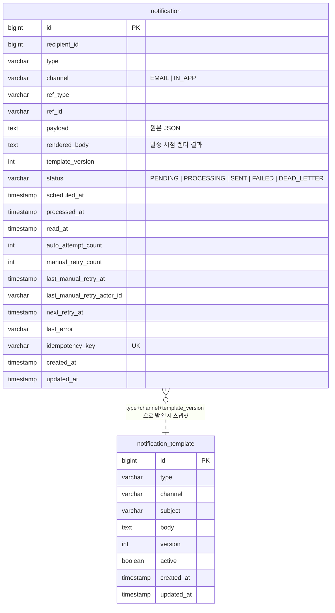

# 알림 발송 시스템

DB 기반 outbox + 폴링 워커 구조. 메시지 큐 (Kafka, RabbitMQ 등) 로 점진 전환 가능하도록 추상화.

추가 문서: [비동기 처리 구조 + 재시도 정책](docs/async-and-retry.md) · [요구사항 해석 + 개선 의견](docs/interpretation.md)

---

## 실행

```bash
docker compose up -d
```

| 서비스 | 포트 | |
|---|---|---|
| `app` | `28080` | http://localhost:28080/swagger-ui/index.html |
| `mysql` | `23306` | `notification` DB |

---

<details>
<summary><b>📡 API 명세 — 펼쳐서 보기</b></summary>

### 사용자 API

| Method | Path | 설명 |
|---|---|---|
| `POST` | `/api/v1/notifications` | 알림 등록 (멱등) |
| `GET` | `/api/v1/notifications/{id}` | 단건 조회 — `X-User-Id` 헤더 필수 |
| `PATCH` | `/api/v1/notifications/{id}/read` | 읽음 처리 — `X-User-Id` 헤더 필수 |
| `GET` | `/api/v1/users/{userId}/notifications?read=` | 수신함 목록 (read 필터 옵션) |

### 운영 API

| Method | Path | 설명 |
|---|---|---|
| `GET` | `/api/v1/admin/notifications/dead-letters` | DEAD_LETTER 목록 |
| `POST` | `/api/v1/admin/notifications/{id}/retry` | DLQ 수동 재시도 — `X-Actor-Id` 헤더 필수 |
| `POST` | `/api/v1/admin/templates` | 템플릿 등록 (버전 자동 증가) |
| `GET` | `/api/v1/admin/templates` | 템플릿 목록 |

### 샘플: 알림 등록

```http
POST /api/v1/notifications
Content-Type: application/json

{
  "recipientId": 42,
  "type": "COURSE_ENROLLMENT_COMPLETED",
  "channel": "EMAIL",
  "refType": "COURSE",
  "refId": "c-100",
  "payload": "{\"courseName\":\"Kotlin in Action\"}",
  "scheduledAt": null
}
```

응답 (`201 Created`, `Location: /api/v1/notifications/1`):

```json
{
  "id": 1,
  "recipientId": 42,
  "type": "COURSE_ENROLLMENT_COMPLETED",
  "channel": "EMAIL",
  "refType": "COURSE",
  "refId": "c-100",
  "scheduledAt": "2026-04-28T01:00:00Z",
  "status": "PENDING",
  "autoAttemptCount": 0,
  "nextRetryAt": null,
  "readAt": null,
  "processedAt": null,
  "lastError": null,
  "renderedBody": null,
  "templateVersion": null,
  "manualRetryCount": 0,
  "lastManualRetryAt": null,
  "createdAt": "2026-04-28T01:00:00Z"
}
```

같은 페이로드로 한 번 더 호출해도 동일한 `id` 가 반환된다 (멱등 — DB UNIQUE 제약 + duplicate-key 무시).

### 샘플: DLQ 수동 재시도

```http
POST /api/v1/admin/notifications/1/retry
X-Actor-Id: admin-001
```

응답: `200 OK`, `status` 가 `DEAD_LETTER → PENDING` 으로 전이되고 `manualRetryCount`, `lastManualRetryAt`, `lastManualRetryActorId` 가 갱신된다. 한도(3회) 초과 시 `409 Conflict`.

### 에러 응답 형식

전 엔드포인트 동일.

```json
{
  "code": "VALIDATION_FAILED",
  "message": "request body validation failed",
  "details": {
    "recipientId": "must not be null"
  }
}
```

| HTTP | code | 발생 조건 |
|---|---|---|
| `400` | `VALIDATION_FAILED` | 본문/헤더/파라미터 검증 실패 |
| `404` | `NOTIFICATION_NOT_FOUND` | 존재하지 않거나 타인 알림 (정보 노출 차단) |
| `409` | `IDEMPOTENCY_CONFLICT` | 동일 키에 다른 payload 가 옴 |
| `409` | `MANUAL_RETRY_LIMIT_EXCEEDED` | 수동 재시도 한도 초과 |
| `409` | `NOT_DEAD_LETTER` | DLQ 상태가 아닌 row 에 retry 호출 |

</details>

<details>
<summary><b>🗄️ DB 스키마 / ERD — 펼쳐서 보기</b></summary>

### ERD



`notification` 과 `notification_template` 은 FK 로 묶이지 않는다. 발송 시점에 렌더 결과(`rendered_body`)와 스냅샷 버전(`template_version`)을 `notification` 자체에 저장해 — 템플릿이 나중에 수정되어도 발송된 메시지는 보존된다.

### 인덱스

| 인덱스 | 컬럼 | 용도 |
|---|---|---|
| `uk_notification_idempotency_key` | `idempotency_key` UNIQUE | 멱등성 — DB 가 중복 INSERT 거절 |
| `ix_notification_status_scheduled` | `(status, scheduled_at)` | 워커의 `PENDING` 폴링 |
| `ix_notification_status_retry` | `(status, next_retry_at)` | 자동 재시도 대상 폴링 |
| `ix_notification_recipient_read` | `(recipient_id, read_at)` | 사용자 수신함 (읽음 필터) |
| `notification_template` UNIQUE | `(type, channel, version)` | 같은 타입/채널 에서 버전 중복 차단 |

### 상태 머신

```
                        ┌─────────────────────────────────┐
                        ↓                                 │
PENDING ──claim──▶ PROCESSING ──send 성공──▶ SENT          │
                        │                                 │
                        ├──send 실패 (autoAttemptCount<5)──▶ FAILED
                        │                                 │
                        │                          (next_retry_at 도달 시 재폴링)
                        │                                 │
                        ├──send 실패 (autoAttemptCount=5)──▶ DEAD_LETTER
                        │                                          │
                        │                                          │ admin retry
                        │                                          ↓
                        │                                       PENDING (autoAttemptCount=0)
                        │
                        └──updated_at > 5분 (타임아웃)──▶ PENDING (Recovery Job)
```

</details>

---

## 테스트

```bash
./gradlew test
```

총 **93건**, 슬라이스를 의도적으로 분리했다.

| 슬라이스 | 어노테이션 | 검증 대상 |
|---|---|---|
| Repository | `@DataJpaTest` | JPA 쿼리, UNIQUE 제약, 인덱스 의존 정렬 |
| Web | `@WebMvcTest` | 컨트롤러 라우팅, 검증, 에러 응답 형식 |
| 통합 (워커 포함) | `@SpringBootTest` | 트랜잭션 경계, 워커 폴링, 처리 타임아웃 복구, 다중 워커 동시성 |

핵심 시나리오:

| 시나리오 | 위치 |
|---|---|
| 멱등성 — 같은 키 N회 호출 → row 1건 | [`IdempotencyKeyTest`](src/test/kotlin/notification/practice/notification/IdempotencyKeyTest.kt) |
| 다중 워커 동시 polling → 중복 발송 0건 | [`worker/ConcurrentWorkerTest`](src/test/kotlin/notification/practice/notification/worker/ConcurrentWorkerTest.kt) |
| 자동 재시도 + DEAD_LETTER 전이 | [`NotificationRetryTest`](src/test/kotlin/notification/practice/notification/NotificationRetryTest.kt) |
| 처리 타임아웃 복구 (`PROCESSING` 5분 초과) | [`worker/ProcessingTimeoutRecoveryTest`](src/test/kotlin/notification/practice/notification/worker/ProcessingTimeoutRecoveryTest.kt) |
| 수동 재시도 + actor 기록 + 한도 가드 | [`ManualRetryTest`](src/test/kotlin/notification/practice/notification/ManualRetryTest.kt) |
| 읽음 처리 멱등성 (다중 디바이스) | [`ReadNotificationTest`](src/test/kotlin/notification/practice/notification/ReadNotificationTest.kt) |
| 템플릿 렌더링 + `rendered_body` 영속 | [`template/NotificationTemplateRenderingTest`](src/test/kotlin/notification/practice/notification/template/NotificationTemplateRenderingTest.kt) |

---

## 설계 결정과 사고 과정

요구사항 자체보다 *"왜 이걸 골랐는가"* 를 적는다. 비교한 대안과 탈락 사유를 함께 남겼다.

### 1. 비동기 처리 — 왜 outbox 폴링인가

요구사항 두 줄이 선택지를 좁혔다.

- *"서버 재시작 후에도 미처리 알림이 유실 없이 재처리되어야 한다"*
- *"다중 인스턴스 환경에서 중복 처리되지 않아야 한다"*

`@Async` / `ApplicationEvent` / 인메모리 큐는 모두 첫 번째 요구사항에 걸린다 — 큐가 메모리에만 있으면 JVM 종료와 함께 사라진다. 두 번째는 분산 락이 추가로 필요해진다.

DB 가 이미 영속성 + 분산 락(SELECT FOR UPDATE)을 동시에 제공하므로 outbox 패턴이 가장 적은 추가 인프라로 두 요구사항을 모두 만족한다. 전체 비교는 [docs/async-and-retry.md §2](docs/async-and-retry.md#2-다른-후보들을-배제한-이유) 참고.

### 2. 멱등성 키 — 클라이언트 vs 서버 생성

호출자가 키를 보내게 하는 모델도 가능했다. 서버 생성으로 결정한 이유:

- 호출자가 키 생성을 잊으면 중복 발송이 자동 발생 — 안전하지 않다
- 서버에서 결정적으로 (`sha256(eventType + refType + refId + recipientId + channel + scheduledAt)`) 만들면 호출자는 *"같은 이벤트 = 같은 인자"* 만 보장하면 됨

`scheduledAt` 도 키에 포함했다 — 같은 이벤트라도 다른 시각에 예약 발송하는 경우 (D-1 / D-3 알림) 별개 row 로 다뤄져야 하기 때문.

> 검증: 같은 페이로드로 3회 호출 → DB row 1건, 응답 `id` 동일 ([`IdempotencyKeyTest`](src/test/kotlin/notification/practice/notification/IdempotencyKeyTest.kt))

### 3. 분산 안전 — `FOR UPDATE SKIP LOCKED` vs ShedLock

ShedLock 같은 *스케줄러 단위 락* 은 결국 동시성을 1로 떨어뜨린다 — 워커를 N 개 띄워도 한 번에 한 인스턴스만 일한다.
`FOR UPDATE SKIP LOCKED` 는 row 단위로 락을 잡으므로 워커 수만큼 처리량이 선형으로 늘어난다.

> 검증: 워커 3 개를 동시에 `poll()` 호출 → 각 알림 정확히 1회 발송 ([`worker/ConcurrentWorkerTest`](src/test/kotlin/notification/practice/notification/worker/ConcurrentWorkerTest.kt))

MySQL 8.0.1+ 가 필요하다는 제약은 `docker-compose.yml` 의 `mysql:8.0` 으로 충족.

### 4. DEAD_LETTER 카운터 분리

수동 재시도 시 `autoAttemptCount` 를 어떻게 할지 세 가지 선택지가 있었다.

| 옵션 | 동작 | 평가 |
|---|---|---|
| 완전 초기화 | `autoAttemptCount = 0` | 동일 원인으로 무한 재시도 위험 |
| 누적 유지 | 카운터 그대로 | 수동 재시도가 의미를 갖지 못함 (즉시 DEAD_LETTER) |
| **분리 (채택)** | `autoAttemptCount` / `manualRetryCount` 독립 | 자동/수동 구분 + 누가 언제 재시도했는지 추적 |

`manualRetryCount >= 3` 가드레일도 추가 — 운영자의 무한 클릭으로 인한 동일 원인 폭주 방지.

> 검증: 한도 초과 시 409 + `MANUAL_RETRY_LIMIT_EXCEEDED` 코드 반환 ([`ManualRetryTest`](src/test/kotlin/notification/practice/notification/ManualRetryTest.kt))

### 5. 템플릿 렌더링 시점

세 가지 시점이 가능했다.

- 등록 시점에 렌더 → 템플릿 변경 시 미발송 알림에 반영 안 됨 / 변수 누락 즉시 발견 가능
- 발송 직전 (워커 안에서) 렌더 → 최신 템플릿 반영 / 변수 누락이 발송 단계에 가서야 발견됨
- 발송 시 렌더 + 결과 저장 (채택) → 최신 템플릿 사용 + `rendered_body` 영속화로 발송 시점 메시지 보존

`rendered_body`, `template_version` 이 `notification` 에 함께 저장되므로 추후 템플릿이 수정되어도 *"실제로 무엇을 보냈는지"* 를 추적할 수 있다.

### 6. 읽음 처리 — 다중 디바이스 동시 요청

같은 알림에 다른 디바이스가 동시에 PATCH 를 날리면 `read_at` 이 마지막 요청 시각으로 덮어 씌워질 수 있다. 조건부 UPDATE 로 해결:

```sql
UPDATE notification
   SET read_at = NOW()
 WHERE id = ?
   AND recipient_id = ?
   AND read_at IS NULL;   -- ◀ 첫 읽음 시각만 기록
```

| 방식 | 결과 |
|---|---|
| 무조건 UPDATE | 마지막 시각으로 덮어씀 (첫 읽음 시각 손실) |
| `SELECT FOR UPDATE` 후 UPDATE | 정확하지만 불필요한 락 |
| **조건부 UPDATE (채택)** | 멱등 + 첫 시각 보존 + 추가 락 없음 |

DB row write lock 이 자동 직렬화하므로 별도 락 불필요.

### 7. 운영 전환 가능성을 위한 추상화

요구사항이 *"실제 운영 환경 전환 가능한 구조"* 를 요구했으므로, 미래에 Kafka 등으로 갈아탈 수 있도록 swap 지점을 미리 노출했다.

```kotlin
interface NotificationDispatcher {           // 발송 트리거
    fun dispatch(notification: Notification)
}
class OutboxDispatcher : NotificationDispatcher  // 현재 (no-op, 워커가 폴링)
class KafkaDispatcher : NotificationDispatcher  // 미래 — 빈 교체만으로 swap

interface NotificationSender {                // 채널별 발송
    fun send(notification: Notification)
}
```

상세는 [docs/async-and-retry.md §7](docs/async-and-retry.md#7-운영-전환-가능성).

---

## 검증 결과

- **빌드**: `./gradlew build` 성공
- **테스트**: 93건 통과, 0 실패
- **린트**: `./gradlew ktlintCheck` 통과 (pre-push 훅에서 강제)
- **컴파일 검증**: pre-commit 훅에서 `compileKotlin compileTestKotlin` 강제

요구사항별 검증:

| 요구사항 | 검증 위치 |
|---|---|
| 알림 등록 / 단건 조회 / 목록 조회 | [`NotificationControllerTest`](src/test/kotlin/notification/practice/notification/NotificationControllerTest.kt), [`NotificationRegistrationTest`](src/test/kotlin/notification/practice/notification/NotificationRegistrationTest.kt) |
| 재시도 정책 + 최종 실패 처리 | [`NotificationRetryTest`](src/test/kotlin/notification/practice/notification/NotificationRetryTest.kt) |
| 중복 발송 방지 | [`IdempotencyKeyTest`](src/test/kotlin/notification/practice/notification/IdempotencyKeyTest.kt) |
| 비동기 처리 (요청 스레드 분리) | [`worker/NotificationWorkerTest`](src/test/kotlin/notification/practice/notification/worker/NotificationWorkerTest.kt) |
| stuck 상태 복구 | [`worker/ProcessingTimeoutRecoveryTest`](src/test/kotlin/notification/practice/notification/worker/ProcessingTimeoutRecoveryTest.kt) |
| 다중 인스턴스 안전성 | [`worker/ConcurrentWorkerTest`](src/test/kotlin/notification/practice/notification/worker/ConcurrentWorkerTest.kt) |
| 발송 스케줄링 (`scheduledAt`) | [`NotificationRegistrationTest`](src/test/kotlin/notification/practice/notification/NotificationRegistrationTest.kt) |
| 템플릿 관리 + 버전 정책 | [`template/NotificationTemplateRepositoryTest`](src/test/kotlin/notification/practice/notification/template/NotificationTemplateRepositoryTest.kt), [`template/NotificationTemplateRenderingTest`](src/test/kotlin/notification/practice/notification/template/NotificationTemplateRenderingTest.kt) |
| 읽음 처리 멱등 (다중 기기) | [`ReadNotificationTest`](src/test/kotlin/notification/practice/notification/ReadNotificationTest.kt) |
| DEAD_LETTER 보관 + 수동 재시도 | [`ManualRetryTest`](src/test/kotlin/notification/practice/notification/ManualRetryTest.kt), [`AdminNotificationControllerTest`](src/test/kotlin/notification/practice/notification/AdminNotificationControllerTest.kt) |

---

## Claude 활용 흐름

이 프로젝트는 Claude Code 를 단순 코드 생성기가 아니라 **워크플로우의 일부** 로 사용했다. 사람이 설계 의사결정을 내리고, 에이전트가 구현 / 검증 / 리뷰를 분담하는 구조다.

### 1. 컨텍스트 로딩

세션 시작 시 Claude 가 자동으로 읽는 파일들:

| 파일 | 역할 |
|---|---|
| [`CLAUDE.md`](CLAUDE.md) | 프로젝트 규약, 코드 컨벤션, 우선 참조 문서 |
| [`.claude/docs/assignment.md`](.claude/docs/assignment.md) | 과제 원문 — 요구사항을 변형하지 않게 함 |
| [`.claude/docs/design-guideline.md`](.claude/docs/design-guideline.md) | 설계 결정 사전 정리 — 구현 방향이 흔들리지 않게 |
| [`.claude/docs/roadmap.md`](.claude/docs/roadmap.md) | 단계별 PR 계획 — 다음 작업 단위 제시 |
| [`.claude/docs/git-conventions.md`](.claude/docs/git-conventions.md) | 브랜치 / 커밋 / PR 규칙 |

CLAUDE.md 가 *"작업 전 반드시 두 문서를 먼저 읽어라"* 를 명시 → 에이전트가 요구사항 / 설계를 무시하고 즉흥 구현하는 일을 차단.

### 2. 커스텀 슬래시 커맨드

`.claude/commands/` 에 정의한 작업 단위.

| 커맨드 | 정의 파일 | 동작 |
|---|---|---|
| `/test` | [`commands/test.md`](.claude/commands/test.md) | `./gradlew test` 실행 후 실패만 요약 |
| `/grade` | [`commands/grade.md`](.claude/commands/grade.md) | `grader` 서브에이전트로 채점 — 100점 만점 + 영역별 근거 + Top 3 개선 |
| `/review-pr` | [`commands/review-pr.md`](.claude/commands/review-pr.md) | 현재 브랜치 디프를 3개 리뷰어 (correctness / adversarial / testing) 에 **병렬** 호출 후 통합 보고 |

### 3. 커스텀 서브에이전트

`.claude/agents/grader.md` 가 핵심. 일반 모델에게 *"엄격하게 채점해라"* 라고 부탁하면 톤이 일정하지 않다 — 채점 룰북을 시스템 프롬프트로 못박은 별도 컨텍스트가 필요하다.

```
영역별 배점 정의 → 도메인 점검 항목 → 감점 시그널 → 출력 형식 → 행동 원칙
```

이 룰북이 있으면 같은 코드를 두 번 채점해도 결과가 거의 일치한다. PR 머지 직전 `/grade` 한 번 호출이 회고 / 검증 / 우선순위 갱신을 동시에 해 준다.

### 4. 작업 흐름 — 한 PR 의 라이프사이클

```
1. 로드맵에서 다음 PR 선택       (.claude/docs/roadmap.md)
        ↓
2. 브랜치 생성 + 구현             (사람: 설계 결정 / Claude: 코드 작성)
        ↓
3. 테스트 작성 + /test 실행      (슬라이스 분리, 실패 시나리오 포함)
        ↓
4. /review-pr (3 리뷰어 병렬)    (HIGH 항목은 PR 전 반드시 처리)
        ↓
5. /grade — 100점 채점           (점수 + 우선순위 Top 3)
        ↓
6. PR 작성 → 머지
```

5번에서 *"문서화 8/10"* 같은 신호가 나오면 다음 PR 의 우선순위가 자연스럽게 갱신된다 — 채점 결과가 다음 작업 입력으로 들어오는 자기 강화 루프.

### 5. 훅과 자동화

[`.githooks/`](.githooks/) 에 git 훅을 두고 `git config core.hooksPath .githooks` 로 연결. 별도 install 스크립트 없이 다음 한 줄로 활성화:

```bash
git config core.hooksPath .githooks
```

| 훅 | 동작 | 목적 |
|---|---|---|
| `pre-commit` | `./gradlew compileKotlin compileTestKotlin` | 컴파일 깨진 채로 커밋되지 않게 |
| `pre-push` | `./gradlew ktlintCheck test` | 린트 / 테스트 깨진 채로 푸시되지 않게 |

훅이 있어도 Claude 가 `--no-verify` 로 우회하지 않게 하기 위해 CLAUDE.md 에 별도 명시는 두지 않았다 — `git commit` 에 훅이 걸리면 에이전트가 자연스럽게 실패 사유를 보고 고치고 재시도한다.

---

## AI 활용 범위

| 도구 | 용도 |
|---|---|
| Claude Code | 코드 / 테스트 / 문서 작성, 셀프 리뷰, 채점 |
| 커스텀 서브에이전트 (`grader`) | 평가 룰북 기반 채점 (자체 검증) |
| `compound-engineering` 리뷰어 3종 | PR 전 셀프 리뷰 (correctness / adversarial / testing) |

**사람이 한 일** (Claude 에 위임하지 않은 의사결정):

- 비동기 구조 선택 — outbox vs 인메모리 vs `@Async` 비교 후 outbox 결정
- 멱등성 키 생성 주체 (서버) + 키 구성 인자 결정
- 분산 락 방식 — `FOR UPDATE SKIP LOCKED` vs ShedLock 비교 후 전자 결정
- DEAD_LETTER 카운터 분리 정책 (자동/수동 독립)
- PR 단위 분리 + 로드맵 작성 (PR 1~9)
- "메시지 브로커 없이" 의 해석 (보수적)
- 처리 타임아웃 임계값 결정 (5 분)
- README / 문서의 톤과 구성

**Claude 에 위임한 일**:

- 위 의사결정에 따른 구현 코드 작성
- 슬라이스 테스트 작성
- 셀프 리뷰 (3 리뷰어 병렬) + 채점
- ktlint / 컴파일 에러 수정
- 문서 초안 작성 (이후 사람이 톤 / 구성 검토)
